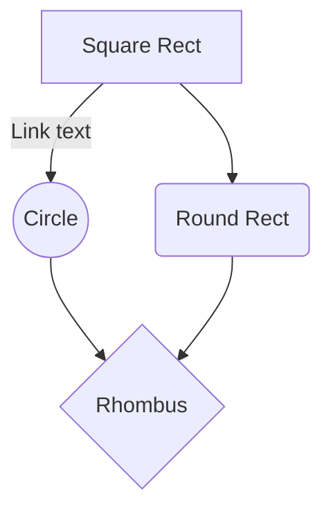

# Procedure: {Nome da procedure}

## Diagrama

{Descrição breve do diagrama}

```mermaid
flowchart TD
    A[Square Rect] -- Link text --> B((Circle))
    A --> C(Round Rect)
    B --> D{Rhombus}
    C --> D

```