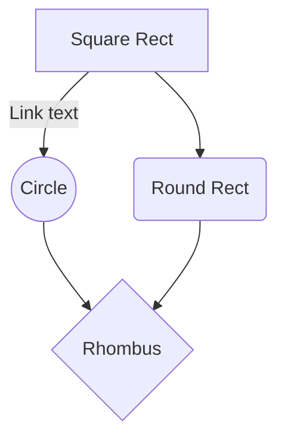
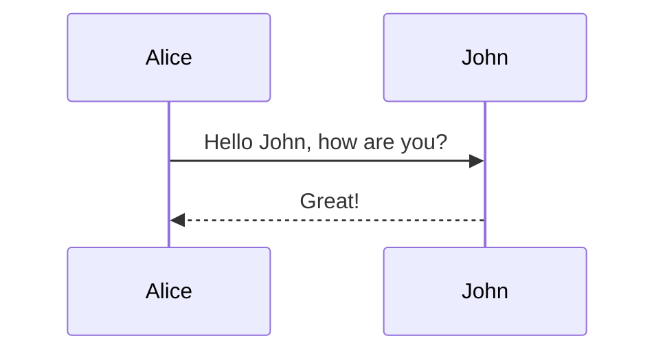
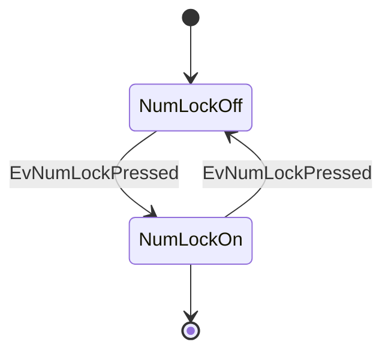
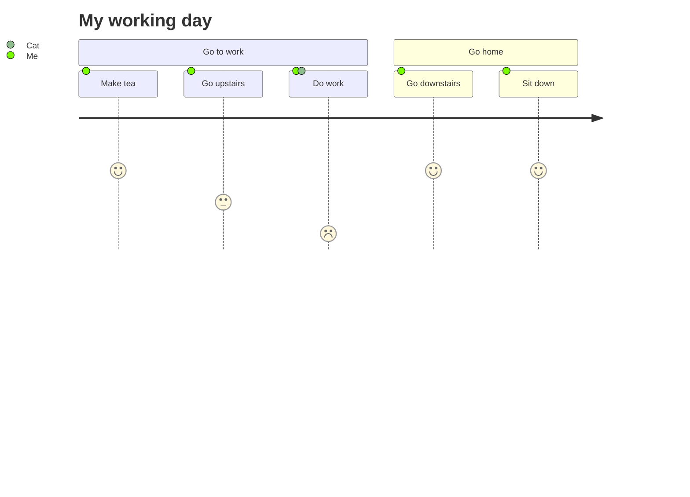

# Procedure: {Nome da procedure}

## Diagramas

### Introdução

{Introdução sobre os diagramas}

### Diagrama 1 - {Nome do diagrama}

{Descrição breve do diagrama}

### Diagrama 2 - {Nome do diagrama}

{Descrição breve do diagrama}

### Diagrama 3 - {Nome do diagrama}

{Descrição breve do diagrama}

### Diagrama 4 - {Nome do diagrama}

{Descrição breve do diagrama}

{Outros diagramas que podem ajudar no entendimento da procedure}
